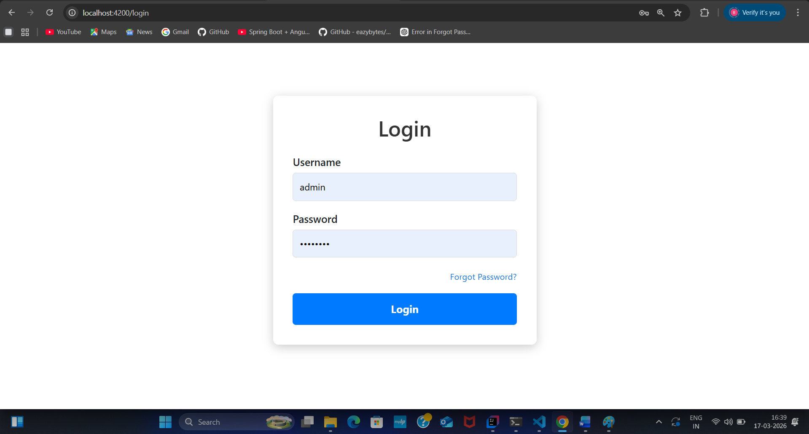
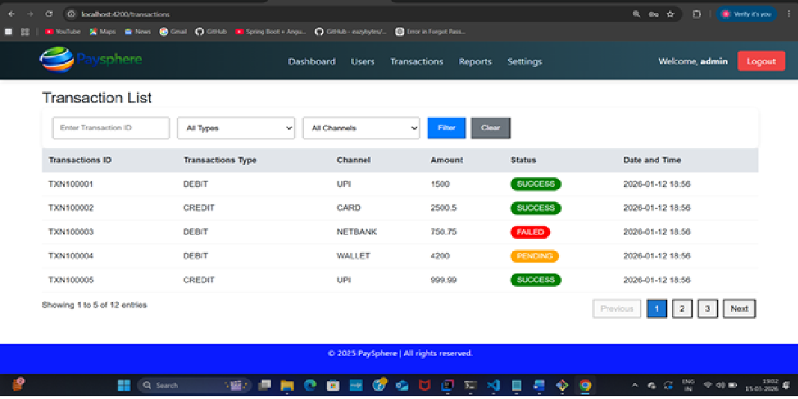
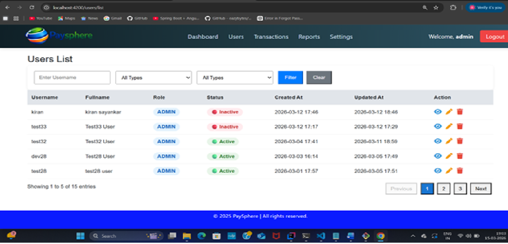
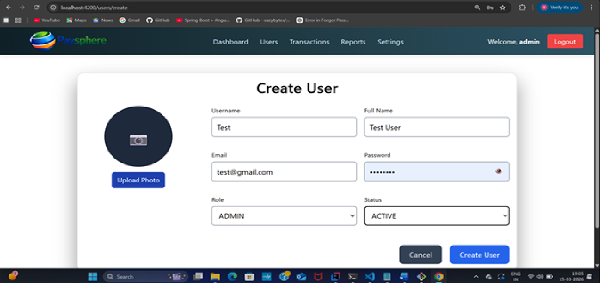
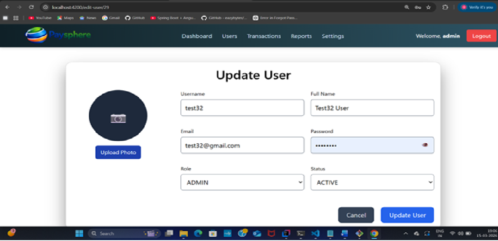
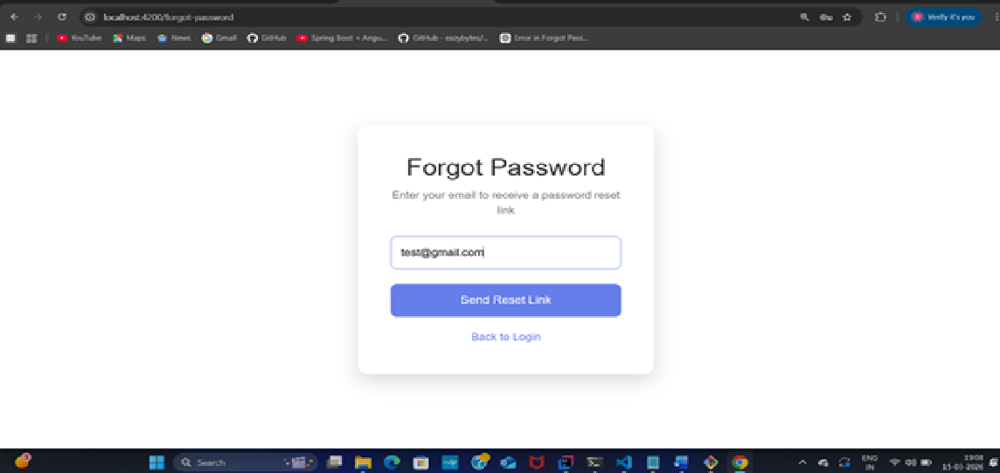
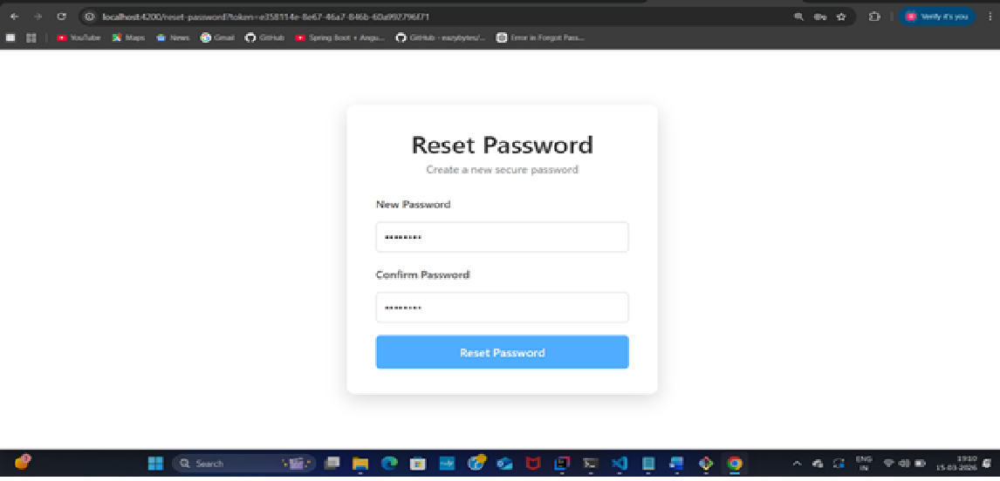

# 💳 PaySphere – Payment & Transaction Management System

## 📌 Project Overview
PaySphere is a secure payment and transaction management system designed to handle financial transactions between users.  
It enables users to create transactions, manage accounts, and generate reports efficiently.

This project demonstrates full-stack development using **Spring Boot (Backend)** and **Angular (Frontend)**.

---

## 🚀 Technologies Used

### 🔙 Backend
- Java 8  
- Spring Boot  
- Spring Data JPA / Hibernate  
- REST APIs  
- MySQL Database  

### 🎨 Frontend
- Angular 18  
- HTML5  
- CSS3  
- Bootstrap / Angular Material  

### 🛠️ Tools
- IntelliJ IDEA  
- Maven  
- Postman  
- Git & GitHub  

---

## ✨ Features

### 👤 User Management
- User Registration  
- Login Authentication  
- Forgot Password  
- Role-Based Access  

### 💳 Transaction Management
- Create Transaction  
- Update Transaction  
- View Transaction Details  
- Delete Transaction  
- Transaction History  

### 📊 Reports
- Transaction Reports  
- Export to PDF & Excel  
- Filter by Date & Status  

### 🔐 Security
- JWT Authentication  
- Input Validation  
- Global Exception Handling  

---
## 🏗️ System Architecture

Angular Frontend
│
▼
REST API Communication
│
▼
Spring Boot Backend
│
▼
Service Layer (Business Logic)
│
▼
Repository Layer (JPA/Hibernate)
│
▼
MySQL Database

## 📸 Screenshots

### 🔐 Login Page

### 💳 Transaction Listt

### 👥 User List

### ➕ Create User

### ✏️ Update User

### 🔑 Forgot Password

### 🔁 Reset Password

## 📡 API Endpoints

### 🔐 Authentication APIs

| Method | Endpoint | Description |
|--------|---------|------------|
| POST | /auth/login | Authenticate user and return JWT token |
| POST | /auth/forgot-password | Send reset password link to email |
| POST | /auth/reset-password | Reset password using token |

---

### 👤 User Management APIs

| Method | Endpoint | Description |
|--------|---------|------------|
| POST | /api/users/create | Create new user (with photo upload) |
| GET | /api/users | Get all users (with pagination & filters) |
| GET | /api/users/{id} | Get user by ID |
| PUT | /api/users/{id} | Update user (with photo upload) |
| DELETE | /api/users/{id} | Delete user |

### 🔍 Query Parameters (GET /api/users)

| Parameter | Type | Description |
|----------|------|------------|
| page | int | Page number (default: 0) |
| size | int | Page size (default: 5) |
| username | String | Filter by username |
| role | String | Filter by role |
| status | String | Filter by status |

---

### 💳 Transaction APIs

| Method | Endpoint | Description |
|--------|---------|------------|
| GET | /api/transactions | Get all transactions (with pagination & filters) |

### 🔍 Query Parameters (GET /api/transactions)

| Parameter | Type | Description |
|----------|------|------------|
| page | int | Page number (default: 0) |
| size | int | Page size (default: 5) |
| transactionId | String | Filter by transaction ID |
| transactionType | String | Filter by type (CREDIT/DEBIT) |
| channel | String | Filter by channel (UPI/CARD/etc.) |

---

## ▶️ How to Run the Project
### 🔙 Backend
Clone repository
git clone https://github.com/yourusername/paysphere.git
Open project in IntelliJ / STS
Configure database in application.properties
Run Spring Boot application
Frontend
Navigate to Angular project
cd paysphere-frontend
Install dependencies
npm install
Application run on
http://localhost:4200

🔮 Future Enhancements
Payment gateway integration
Microservices architecture
Kafka event streaming
Real-time notifications
Cloud deployment (AWS / Docker)

## 👩‍💻 Author

**Bhagyashri Sayankar**  
💼 Java Backend Developer  
🚀 Skills: Java, Spring Boot, Hibernate, Angular  
Java Backend Developer
Skills: Java, Spring Boot, Hibernate, Angular,
